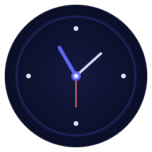

<h1 align="center">🕰️ Dymi</h1>

<p align="center">
  <strong>Time, beautifully rendered.</strong><br/>
  A calm, precise clock for the modern web.
</p>

<p align="center">
  <a href="LICENSE"></a>
  <a href="package.json"></a>
  <a href="https://github.com/CrescentDB/dymi/actions"></a>
  <a href="CONTRIBUTING.md"></a>
</p>

<p align="center">
  
  
  
  <a href="https://github.com/CrescentDB/dymi/stargazers">
    
  </a>
</p>

<p align="center">
  <a href="https://dymi.netlify.app/">Live Demo</a> ·
  <a href="https://github.com/CrescentDB/dymi/issues">Report Bug</a> ·
  <a href="https://github.com/CrescentDB/dymi/issues">Request Feature</a>
</p>

<p align="center">
  
</p>

---

## Why Dymi?

Dymi is a **minimal, elegant, open‑source clock** built for focus‑first environments. No clutter. No distractions. Just time—rendered smoothly, accurately, and beautifully.

Whether you pin it to a second monitor, run it fullscreen, or embed it in a kiosk setup, Dymi stays out of your way and looks great doing it.

---

## ✨ Features at a Glance

<table>
<tr>
<td width="50%">

### 🎨 Visual Polish

* Ultra‑smooth 50 ms interpolation
* Carefully designed themes
* Subtle glassmorphism
* Fully responsive layout

</td>
<td width="50%">

### ⚡ Performance First

* Instant Vite startup
* Tiny bundle footprint
* 95+ Lighthouse score
* Offline‑ready (PWA)

</td>
</tr>
<tr>
<td width="50%">

### 🌍 Time, Everywhere

* 16+ time zones
* 12 / 24‑hour modes
* Automatic day/night theming
* Smart locale handling

</td>
<td width="50%">

### 🛠️ Developer‑Friendly

* TypeScript + React
* Clean, readable architecture
* Simple configuration
* Easy to fork & extend

</td>
</tr>
</table>

---

## 🚀 Quick Start

```bash
# Clone
git clone https://github.com/CrescentDB/dymi.git
cd dymi

# Install dependencies
npm install

# Start development server
npm run dev
````

Open `http://localhost:5173` in your browser.

---

## 📦 Deployment

### One‑Click Deploy

[](https://vercel.com/new/clone?repository-url=https://github.com/CrescentDB/dymi)
[](https://app.netlify.com/start/deploy?repository-url=https://github.com/CrescentDB/dymi)

### Docker

```bash
docker-compose up -d
```

See the [Installation Guide](./docs/INSTALLATION.md) for more options.

---

## 🎨 Themes

| Theme        | Description                       |
| ------------ | --------------------------------- |
| **Midnight** | Deep indigo tones for dark rooms  |
| **Aurora**   | Teal & coral with subtle contrast |
| **Minimal**  | Clean, bright, distraction‑free   |
| **Auto**     | Adapts to system time             |

---

## ⌨️ Keyboard Shortcuts

| Key     | Action              |
| ------- | ------------------- |
| `Space` | Toggle fullscreen   |
| `T`     | Cycle themes        |
| `S`     | Open settings       |
| `Esc`   | Exit / close panels |

Full list → [Keyboard Shortcuts](./docs/KEYBOARD_SHORTCUTS.md)

---

## 💝 Sponsor / Support Good Causes

Dymi does **not accept personal donations**. If you enjoy using it and want to make a positive impact, please consider supporting these charities directly:

[](https://www.givewell.org/donate)
[](https://www.effectivealtruism.org/donate)
[](https://www.unicef.org/donate)
[](https://www.khanacademy.org/donate)

---

## 📚 Documentation

* **[Installation](./docs/INSTALLATION.md)** — Run anywhere
* **[Customization](./docs/CUSTOMIZATION.md)** — Make it yours
* **[Architecture](./docs/ARCHITECTURE.md)** — Design decisions
* **[FAQ](./docs/FAQ.md)** — Common questions
* **[Contributing](./CONTRIBUTING.md)** — Get involved

---

## 🛠️ Tech Stack

* **Framework**: React 18
* **Language**: TypeScript
* **Bundler**: Vite
* **Icons**: Lucide
* **Styling**: Modern CSS + custom properties

---

## 📊 Project Health


---

## 🤝 Contributing

Open source thrives on collaboration. If you have an idea—small or big—we’d love to see it.

1. Fork the repo
2. Create a branch (`feature/your-feature`)
3. Commit your changes
4. Push and open a Pull Request

See [CONTRIBUTING.md](./CONTRIBUTING.md) for guidelines.

---

## 🌟 Stargazers

[](https://github.com/CrescentDB/dymi/stargazers)

---

## 📄 License

Licensed under **CSPL v3.3**. See [LICENSE](./LICENSE) for details.

---

## 💝 Acknowledgments

Built for people who value clarity, calm, and craft.

Thanks to:

* React & Vite teams
* Open‑source maintainers everywhere

